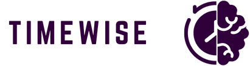
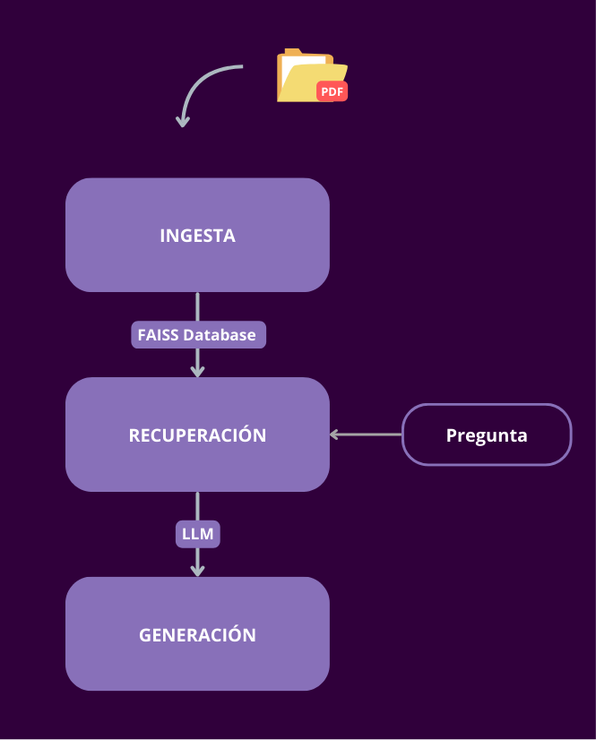
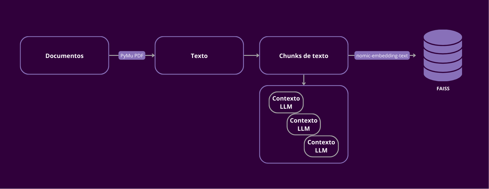
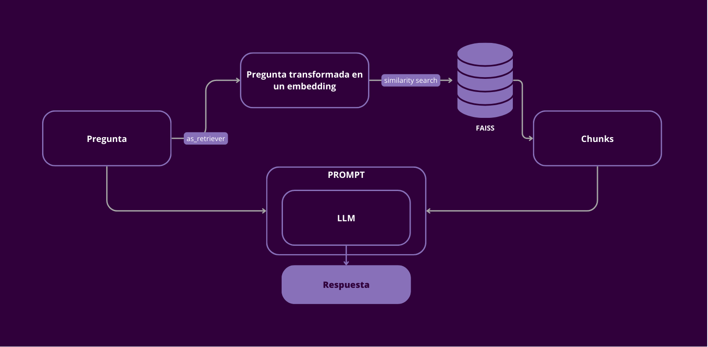

# TimeWise

## Introducción
Este es el **MVP** de *TimeWise*, software dedicado a mejorar la productividad de las empresas. El producto se basa en un **chat** enfocado en la agilización y optimización del **onboarding** en las compañías. Como empleado, podés consultarle al chat las dudas que tenés respecto a información relativa a la empresa, sector, herramientas o metodologías.

Como tu asistente personal, *TimeWise* provee **información certera y relevante, basándose en el conocimiento almacenado**.

## Aplicación de chat con RAG + LangChain
El software está conformado por:
- **<u>Generación Aumentada por Recuperación (RAG)</u>**: integra mecanismos de recuperación para proporcionar resultados más precisos y contextualmente relevantes (es decir, basándose en la información cargada a partir de **documentos PDF**).
- **<u>LangChain</u>**: *framework* diseñado para crear aplicaciones de modelos de lenguaje (*LLMs*) más sofisticadas, a partir de la combinación de diferentes componentes (como el procesamiento de los documentos y generación de embeddings).
- **<u>FAISS</u>**: permite realizar búsquedas por similitud a partir de los vectores generados por los documentos.
- **<u>Ollama</u>**: permite interactuar con una amplia gama de LLM preentrenados.
- **<u>Reflex</u>**: *framework* de código abierto que permite crear aplicaciones web e interactivas utilizando únicamente *Python* como lenguaje.
- **<u>Llama 3.2</u>**: es un modelo de IA de código abierto de Meta, capaz de procesar texto e imágenes. Para este proyecto se utilizó el modelo **1B**, el cual es más ligero (sólo procesa textos y menos costoso computacionalmente).
- **<u>PyMu PDF</u>**: biblioteca de Python que permite visualizar y manipular documentos.
- **<u>Nomic-embed-text</u>**: modelo de transformación de texto en representaciones vectoriales.

## Paso a paso: desde la carga hasta la 

### Ingesta de doumentos

En primer lugar, el usuario con rol *Administrador* debe cargar en la aplicación el/los archivo/s en formato PDF, los cuales contienen la información relevante al *Onboarding*. Es importante aclarar que en esta instancia, al ser un MVP, no hay asignación de roles ya que el producto se encuentra en una etapa de testeo y mejora de funcionalidades, por lo que esa configuración es mandatoria para la implementación de cara a nuestros primeros clientes.

Luego de cargarlo/s, el usuario debe seleccionar el botón *"Procesar"* para que los mismos sean procesados. Esto significa que, a través de la librería *PyMu PDF*, se extrae el texto de los documentos. Ese texto se divide en *chunks*, es decir, porciones más pequeñas que se superponen. Así, el LLM las puede procesar, manteniendo el contexto del texto original.

Estos *chunks* se almacenan en la base de datos *FAISS*. Para ello, utilizamos el modelo *nomic-embed-text* para transformar esos datos en *embeddings* (vectores numéricos).

### Generación Aumentada por Recuperación

Una vez cargados los documentos, los usuarios pueden comenzar a realizarle preguntas a TimeWise. La pregunta enviada es transformada (por el método *as_retriever*) a un embedding. Este embedding se compara con los otros vectores almacenados en la base de datos *vector_store*, utilizando la métrica *MMR (Maximal Marginal Relvance)*. Aquellos vectores que sean más relevantes (más relacionado a la consulta) y diverso (qué tan diferente es de los vectores ya seleccionados), son **recuperados** como contexto relevante. Los parámetros que ajustan cómo funciona ese método de búsqueda son:

- <u>k=3</u>: significa que se devuelven los 3 vectores más importantes
- <u>fetch_k=200</u>: mira hasta 200 vectores con el objetivo de encontrar a los 3 mejores.
- <u>lambda_mult=1</u>: se asigna un peso alto a la importancia en la diversidad de los vectores recuperados.

Luego, se juntan los embeddings recuperados relvantes al contexto con el embedding de la consutla, y se genera el *promt*. Este tiene como mensaje principal hacia el LLM, lo siguiente: *"Eres un asistente para tareas de preguntas y respuestas. Utiliza los siguientes fragmentos de contexto recuperado para responder la pregunta. Responde en viñetas. Asegúrate de que tu respuesta sea relevante para la pregunta y esté basada únicamente en el contexto proporcionado."*

El *prompt* es enviado al modelo *Llama 3.2:1B*, el cual genera la respuesta final.

## Alojamiento en la nube
La aplicación se encuentra alojada en una instancia *EC2* en *AWS*. Como configuración del software (sistema operativo, servidor y aplicaciones) se eligió **Deep Learning OSS Nvidia Driver AMI GPU PyTorch 2.4.1 (Ubuntu 22.04) 20241103**, con tipo de instancia **c7i.xlarge**, el cual contiene **4 CPUs** virtuales.

## ¿Por qué RAG?
El framework utilizado ayuda a los *LLM* ser más precisos y estar al día (actualizados con la información).

El método RAG le agrega a los modelos de lenguaje una capa de "correctitud" en las respuestas que generan. Es decir, agregan **contexto** (puede ser una página web o un archivo). Esto significa dos cosas: el *LLM* no debe ser entrenado cada vez que hay información nueva; y, el modelo revisa, antes de dar una respuesta, la fuente de información a la que debe enmarcarse para contestar. Esto genera que se reduzcan las posibilidades de *alucinar* o de filtrar datos.

El framwork brinda seguridad al usuario debido a que tiene la posibilidad de decir que *no sabe algo* (en función del contexto proporcionado).

## Validación: MVP en marcha
Como parte de la implementación de nuestro MVP, decidimos testearlo con varios empleados, de distintos rubros y roles, para analizar si la oportunidad que hayamos es realmente un punto de mejora en las empresas, y para encontrar qué mejoras o cambios se podrían llevar a cabo en el producto.

Entre los comentarios, surgieron los siguientes:
- Posibilidad de procesamiento de más de un tipo de archivo: actualmente, el MVP sólo procesa archivos PDF. Sin embargo, a partir de este comentario, descubrimos que archivos de tipo Excel, videos o incluso desde páginas web, podrían ser de gran utilidad e, incluso, mandatorios ya que los archivos varían de empresa en empresa.
- Posibilidad de descarga del archivo desde la aplicación: además de las respuestas del chat, surgieron propuestas para que los usuarios pudieran descargar los archivos cargados para que los puedan consultar directamente.
- Posibilidad de ser una herramienta más dentro de otras plataformas o sistemas: es decir, que no sólo sea una aplicación aparte desde la que se accede únicamente a través del navegador, sino que pueda ser incluida (y, así, accesible rápidamente) en otras herramientas.
- Posibilidad de mejora en los tiempos de carga de los archivos y las respuestas: es mandatorio la velocidad del modelo para que los empleados no la dejen de usar sólo por tal motivo.

Estos comentarios nos permiten redefinir y mejorar nuestro MVP de cara a nuestros primeros clientes.

